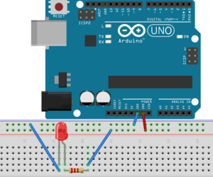
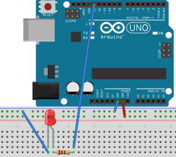

# Arduino Lab 4 - 2020 - Home startup

## Pre-installation (Arduino stuff)


  * You may have to install the following (Linux) packages: `arduino` ,
`gcc-avr` (or `avr-gcc`) and `avrdude` (`avr-binutils` et `avr-libc` if they are not included)
  * `avrdude.conf` must be in `/usr/share/arduino/hardware/tools/` (if not you have to modify Makefiles).
  * The user should have the right to write on  the USB port :
`usermod -aG dialout <username>` (and re-login).


## Some Arduino general information

Arduino/Genuino cards are free cards build around a Atmel AVR
microntroler. In this lab we will use  Arduino UNOs (atmega328p) like
in the following picture. The platform has a few numerical and
analogic I/Os where we will connect LEDs, buttons, seven segment led
displays...

The microcontroler itself is programmed with a bootloader so that a dedicated
system is not necessary. The Makefile we give you will use   `avrdude`
[doc](http://www.nongnu.org/avrdude/) to load the binaries into the
microcontroler memory.

You will be given a whole platform with an arduino UNO, some leds, a
breadboard, wires ...  **You will be responsible for them for the
duration of the lab** On the breadboards, all points in a given
supply line (blue/black, red) are connected. Same for the columns.


## Getting started with the breadboard (raw C stuff).

First of all, make a simple circuit to test the board itself: 



The board should be powered : blue/black line to arduino ground (GND)
and red line to arduino +5V. Plug the arduino to the USB port of your
laptop, the led should shine. 

Now, let us program a blinking LED. 

**From now, shematics implicitely contain the wire required to power
the board (link from red lines to 5V, link from blue/black lines to GND)**


### LED on Digital 13

* Led on digital 13 with 220 ohm resistor. (long leg to digital 13)



* TODO : Test the low level code in `_code/blinkingled` (make, make
  upload)
  
### Understand Arduino Programming style

Here is the pattern we will use to program the Arduino :

```C
#include <avr/io.h>
#include <util/delay.h>

void setup(void) {}

int main(void)
{
  setup();
  while(1)
  {
    // Business code goes here
    _delay_ms(1000);
  }
}
```

The program to embed on the board implements an infinite loop, where the main behavior will be called. The `setup` procedure is used to initialize the board, //e.g.//, specify which pin is used as input or output.


To switch a led on or off on a Arduino, we need to
* configure the port/pin where the led is connected into
  _reading mode_ (in the setup procedure)
* write a 0 (off) or a 1 (on) into the same port when required.

Some information:
* As the led is linked to digital pin 13, the port to be manipulated
  is DDRB, here every single pin from 8 to 13 is set to "input" (0)
  excepting bit 5 which gives an "output" access to the led (1).

* To make  the led blink, use  the xor
  operator to toggle the 5th bit from 0 to 1 or 1 to 0 each
  time we enter a different loop: `PORTB ^= 0bxxxxxxxx;' (replace x
  with bits values).

### 7 segments display . (Common Anode OR Common Cathode)

* 7 segments labels:

 

* 7 segment : a on digital 1 via resistor 220 ohm, b on digital 2, ...
  g on digital 7, according to the preceding numbering. 
  
**Warning, the 7 segment display should be connected though resistors
(from 220 to 400 ohm) -- NEW PICTURE**

* Plug your 7 segment as if it was Common Anode (most probably it is the case) like in the following picture:


(comon anode can be horizontal or vertical, be careful).

* Test your wiring with the test file in `_code/test7segV2` (you have a Readme file) Understand this code. From now, you should know if you have a CC or CA 7-segment display.


### Additional documentation (please have a look)

Other links:
* [port manipulation](https://www.arduino.cc/en/Reference/PortManipulation). Warning,
the documentation is for the Arduino Lib format. In raw C, you should use
`0b11111110` (rather than `B11111110`).
* [Boolean operators](http://playground.arduino.cc/Code/BitMath),
* [AVR libc doc for delays](http://www.nongnu.org/avr-libc/user-manual/group__util__delay.html).


